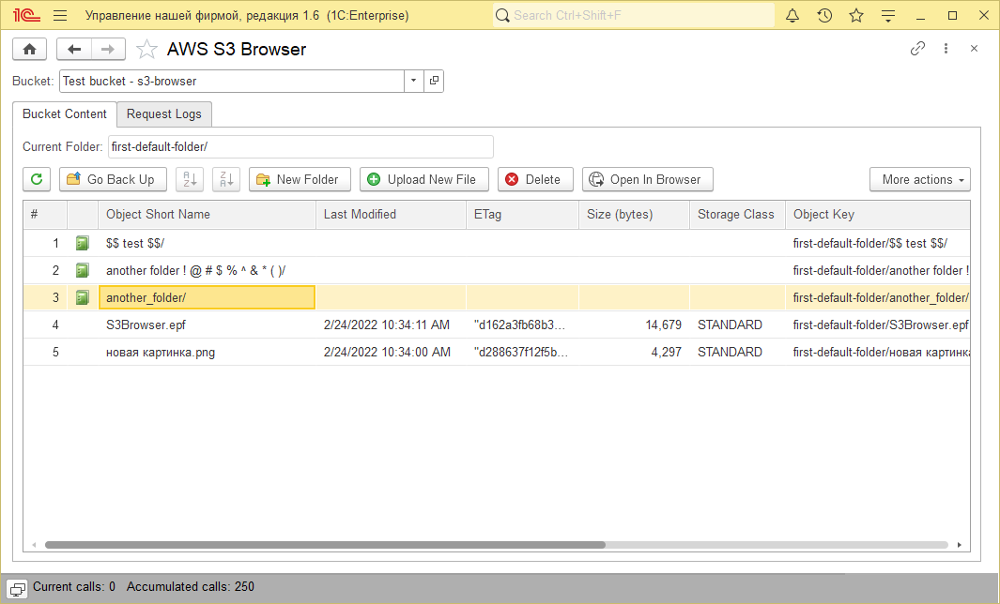
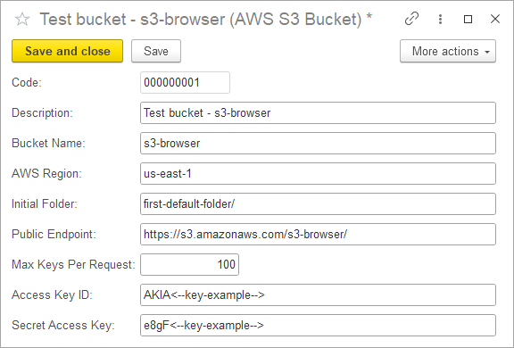

# 1C:Enterprise 8 - REST API AWS S3 Browser
*Minimum platform version required: 8.3.18.*

A configuration extension that demonstrates working with AWS S3 using the REST API - no external components, SDK or CLI required. 
Requests are signed using [AWS Signature Version 4](https://docs.aws.amazon.com/AmazonS3/latest/API/sig-v4-authenticating-requests.html).  
This is a prototype and not production-read solution.

### Supported operations:
- **List Bucket** - a single request to return up to "Max Keys Per Request" keys (no recursion for large lists).
- **Create New Folder** - add an empty key to stage a new folder*.
- **Upload New File** - add a new file into current folder*
- **Delete File** - delete selected object.

*(there are no folders in S3 - this is just a simplification)*

MIT License.

